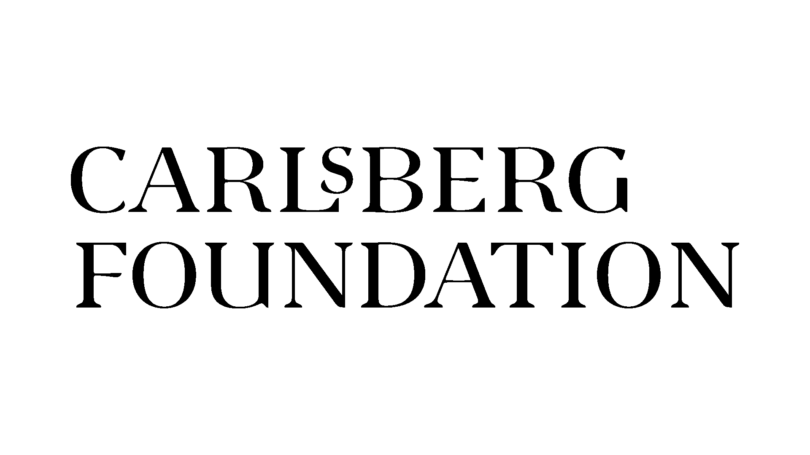

  
  
  

Dimensions of Radical Embodiment 3 is a three-in-one event comprising:

**Wednesday, June 18** Workshop: Introduction to Cognitive Ethnography

**Thursday, June 19 and Friday June, 20** Dimensions of Radical Embodiment 3

**Saturday, June 21** Workshop: Computational Creativity, Embodiment, and Problem Solving

There is no conference fee to attend any of the events.

## Call for contributions
- Talk: submit your 15 minute talk 
- Poster: Or poster!
- Short contributions (5 minutes or less): Do you have a question or idea that you want to share with the radical embodiment community and get feedback? You can also submit a short contribution.

How to submit: Send an abstract, maximum 200 words.

To submit: [**complete the form here**](https://forms.gle/s6vA5bnYCurdYjoB9)

**Deadline: March 14, 2025.**

Notification of acceptance: March 31, 2025.

## Invited keynote speakers
- **Manuel Heras-Escribano**, University of Granada
- **Sofie Pedersen**, Roskilde University
- **Vicente Raja**, University of Murcia

## Contact us

If you have any questions, feel free to contact the organizers
- **Ed Baggs** (ebag@sdu.dk).
- **Sune Vork Steffensen** (s.v.steffensen@sdu.dk)
- **Sarah Bro Trasmundi** (sarbro@sdu.dk)

Problem solving workshop:
- **Martyna Meyer** (mamey@sdu.dk)
- **Bailey Fernandez** (bailey_f@mit.edu)

The conference is supported by the Carlsberg Foundation, grant CF24-2332.

